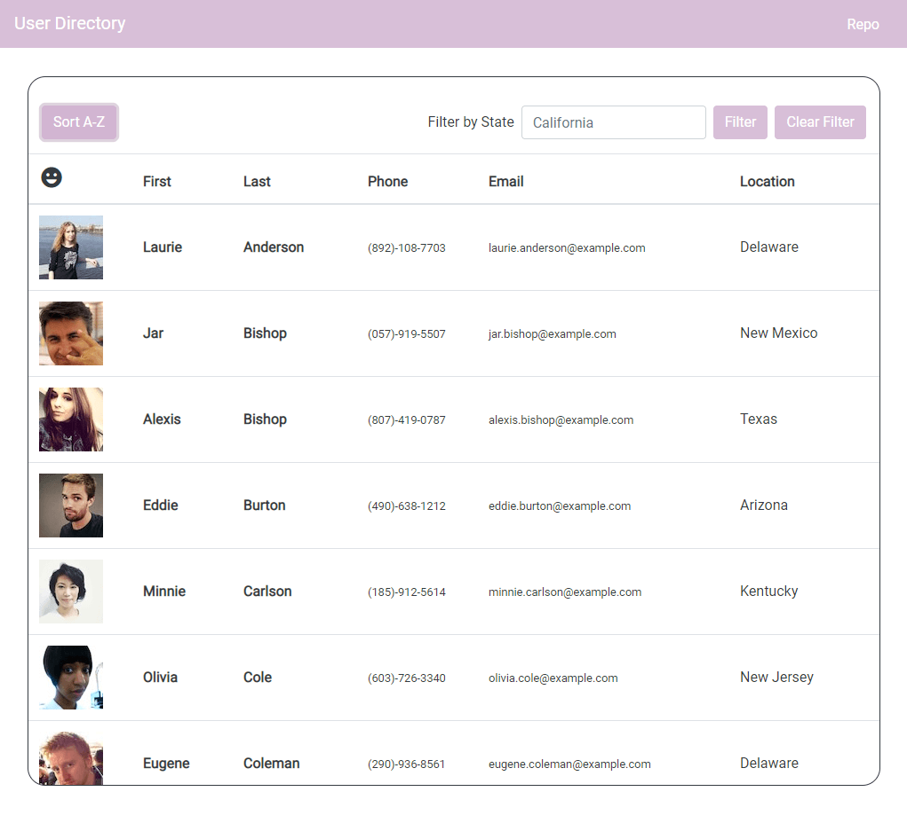
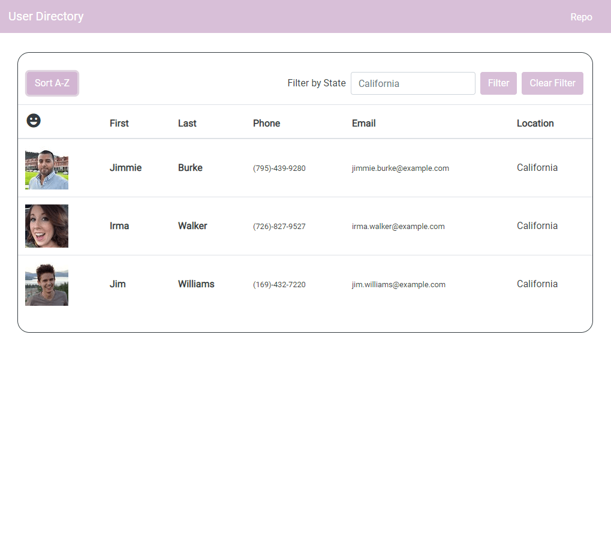

# React User Directory 👩‍💻

#### 📍 [View Deployment on GitHub Pages](https://katsign.github.io/react-user-directory) 📍

### View, sort and filter through a list of users.

## *Table of Contents*

- [Description](#description)
- [Installation](#installation)
- [Usage](#usage)
- [Screenshots](#screenshots)
- [Contact](#contact)

## *Description*

This web app uses state management in React to allow a user to view, sort and filter through a list of users in a directory.

## *Installation*

### Local Clone

#### Navigate into the repository folder on your local machine and open the built-in terminal. You will need Node.js installed to run this application.

- On the command line, type `npm i` to pull the app's dependencies to your local.
- Type `npm start` to run the application locally.
- Navigate to `http://localhost:3000` to view the development server.

## *Usage*

- When the components mount to the DOM, a table of users from the [Random User Generator](https://randomuser.me/) is displayed.
- Click `Sort A-Z` to sort the results by last name.
- Use the inline form to input a State and click `Filter` to view the results.
- These results can then be sorted by last name.
- Click `Clear Filter` to return a new set of users.

## *Screenshots*

Sorted by Name  |  Filtered by State
:-------------------------:|:-------------------------:
  |  

## *Contact*

🔗 Links in Bio @[katsign](https://github.com/katsign)

---
This project is MIT licensed. &copy; 2021
